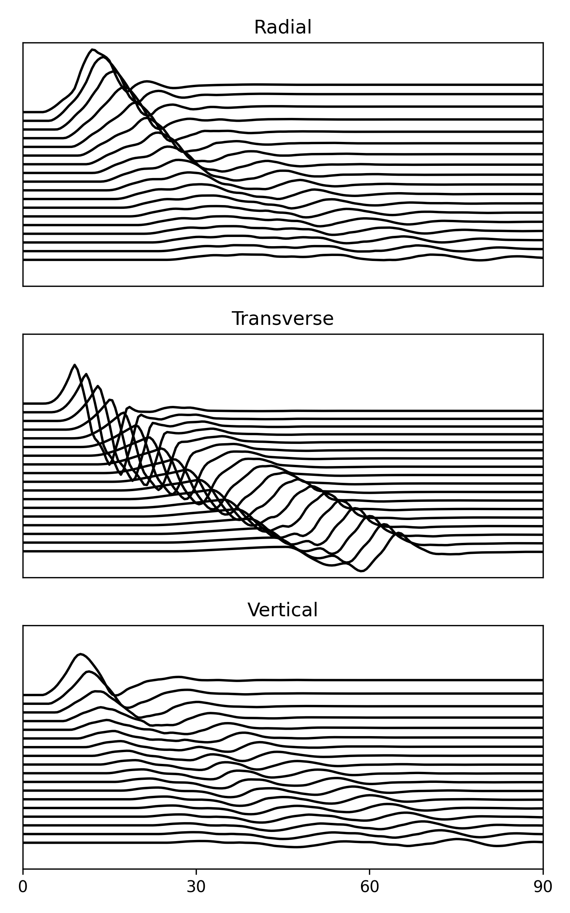
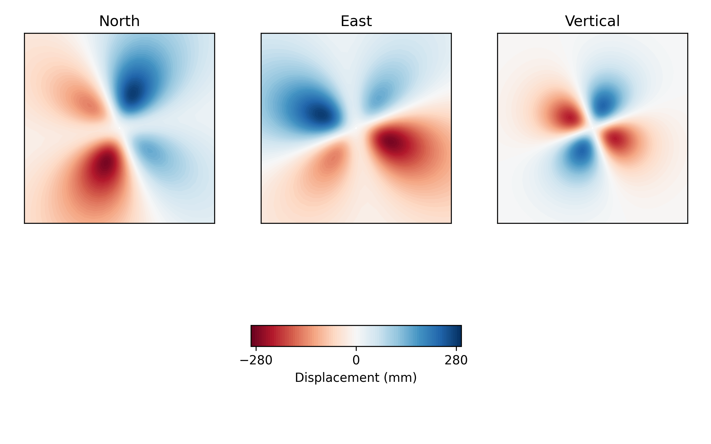

.. _example:

=================
Annotated example
=================
This example walks you through the process of calculating simulated seismic observables. This example can also be downloaded as a :download:`standalone Python script <./example.py>`. It is based on examples shown in `O'Toole &
Woodhouse (2011) <https://academic.oup.com/gji/article/187/3/1516/616302>`_.

We begin by importing some standard libraries::

   import numpy as np
   import matplotlib.pyplot as plt

We then import the ``pyprop8`` core routines, and some utility functions::

   import pyprop8 as pp
   from pyprop8.utils import stf_trapezoidal, make_moment_tensor, rtf2xyz

Our first task is to define the earth model we wish to use. This requires us to create an instance of :py:func:`~pyprop8.LayeredStructureModel`. We specify thicknesses, P- and S-wave velocities and density in each layer::

   #                                  thick.  Vp    Vs    rho
   model = pp.LayeredStructureModel([[ 3.00, 1.80, 0.00, 1.02],
                                     [ 2.00, 4.50, 2.40, 2.57],
                                     [ 5.00, 5.80, 3.30, 2.63],
                                     [20.00, 6.50, 3.65, 2.85],
                                     [np.inf,8.00, 4.56, 3.34]])

Note that this example has an S-wave velocity of zero in the uppermost layer - i.e. this is a fluid.

Next, we define the properties of the seismic source. We choose to use :py:func:`~pyprop8.utils.make_moment_tensor` to construct a moment tensor from strike, dip and rake angles. However, this outputs a moment tensor using the global seismology convention of polar coordinates, and so we need to use :py:func:`~pyprop8.utils.rtf2xyz` to convert it to Cartesian form. We set the force vector to zero::

   strike = 340
   dip = 90
   rake = 0
   scalar_moment = 2.4E8
   Mxyz = rtf2xyz(make_moment_tensor(strike, dip, rake, scalar_moment,0,0))
   F =np.zeros([3,1])

For this example, we assume the event occurred at the origin of the coordinate system, at a depth of 34km below the 'top' of the model (which, given the 3km water layer, corresponds to a depth of 31km below the sea floor). We can then create an instance of :py:class:`~pyprop8.PointSource`::

   event_x = 0
   event_y = 0
   event_depth = 34
   event_time = 0
   source =  pp.PointSource(event_x, event_y, event_depth, Mxyz, F, event_time)

Finally, we need to define our recording locations. For this example, we create a set of 18 equally-spaced stations due North of the earthquake::

   stations = pp.ListOfReceivers(xx = np.zeros(18),yy=np.linspace(30,200,18),depth=3)

We are now ready to perform our simulations. We request 181 data points, sampled at 2Hz, and apply a trapezoidal source time-functions::

   nt = 181
   dt = 0.5
   tt,seis = pp.compute_seismograms(model, source, stations, nt, dt,
                                    xyz=False,source_time_function=lambda w:stf_trapezoidal(w,3,6))

Because we (implicitly) used the default option of ``squeeze_outputs=True``, the output array ``seis`` has shape ``(18, 3, 181)``: 18 stations, with 3 components and 181 time series points for each. We can plot the result::

   fig = plt.figure(figsize=(5,8))
   ax = fig.subplots(3,1)
   ax[0].set_title("Radial")
   ax[1].set_title("Transverse")
   ax[2].set_title("Vertical")
   for i in range(18):
       # Plot each trace, shifting by 50 units between each
       ax[0].plot(tt,seis[i,0,:]-50*i,'k')
       ax[1].plot(tt,seis[i,1,:]-50*i,'k')
       ax[2].plot(tt,seis[i,2,:]-50*i,'k')
   for i in range(3):
       ax[i].set_xlim(0,90)
       ax[i].set_ylim(-1000,400)
       ax[i].set_xticks([])
       ax[i].set_yticks([])
   ax[2].set_xticks([0,30,60,90])
   plt.tight_layout()
   plt.savefig('fig1.png',dpi=300)
   plt.show()

All being well, you should obtain the following image, which matches Fig. 1 of `O'Toole &
Woodhouse (2011) <https://academic.oup.com/gji/article/187/3/1516/616302>`_:

Our second example simulates regional static offset. We change the earth model to one representing a homogeneous half-space, and we change our station distribution to a dense, regular array::

   model_halfspace = pp.LayeredStructureModel([[np.inf,6.00,3.46,2.70]])
   stations = pp.RegularlyDistributedReceivers(1,151,300,0,360,72)

Now it is straightforward to compute the static offset information::

   static = pp.compute_static(model_halfspace,source,stations)
   amax = abs(static).max()

To plot the data, we use :py:func:`~matplotlib.pyplot.contourf` to interpolate between stations. The output array, ``static``, has shape ``(nr, nphi, 3)``, where ``nr`` and ``nphi`` are the numbers of stations defining our (polar) grid of receivers. We use :py:meth:`~pyprop8.RegularlyDistributedReceivers.as_xy` to obtain x- and y-coordinates for each station::

   fig = plt.figure(figsize=(8,5))
   ax = fig.subplots(2,3)
   ax[0,0].contourf(*stations.as_xy(),static[:,:,1],levels=np.linspace(-1.05*amax,1.05*amax,101),cmap=plt.cm.RdBu)
   ax[0,1].contourf(*stations.as_xy(),static[:,:,0],levels=np.linspace(-1.05*amax,1.05*amax,101),cmap=plt.cm.RdBu)
   sc = ax[0,2].contourf(*stations.as_xy(),static[:,:,2],levels=np.linspace(-1.05*amax,1.05*amax,101),cmap=plt.cm.RdBu)
   for i in range(3):
       ax[0,i].set_xlim(-100,100)
       ax[0,i].set_ylim(-100,100)
       ax[0,i].set_aspect(1)
       ax[0,i].set_xticks([])
       ax[0,i].set_yticks([])
   ax[0,0].set_title('North')
   ax[0,1].set_title('East')
   ax[0,2].set_title('Vertical')

   ax[1,1].set_aspect(.1)
   c = plt.colorbar(sc,cax=ax[1,1],orientation='horizontal',label='Displacement (mm)')
   c.set_ticks([-amax,0,amax])
   ax[1,0].set_visible(False)
   ax[1,2].set_visible(False)
   plt.tight_layout()
   plt.savefig('fig2.png',dpi=300)
   plt.show()

This should produce a figure matching Fig. 2 of `O'Toole &
Woodhouse (2011) <https://academic.oup.com/gji/article/187/3/1516/616302>`_:

